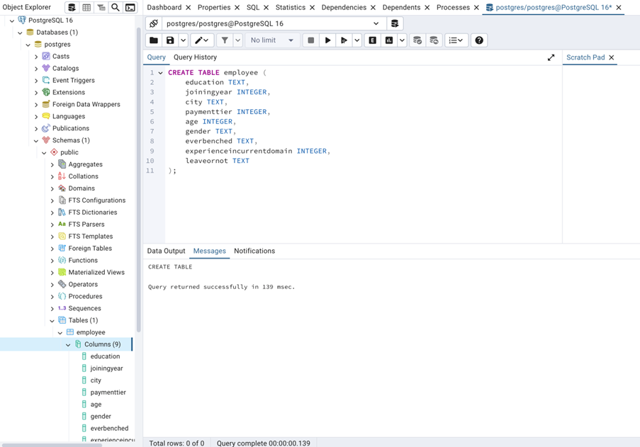
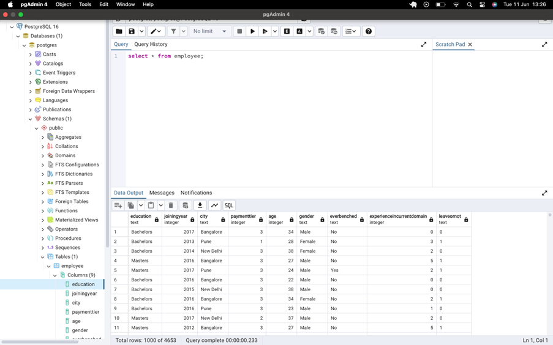
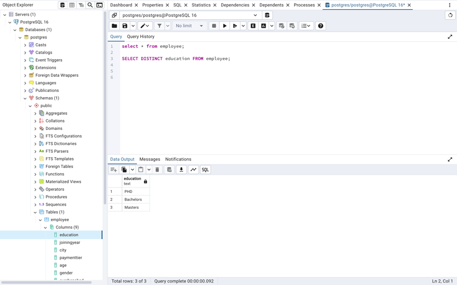
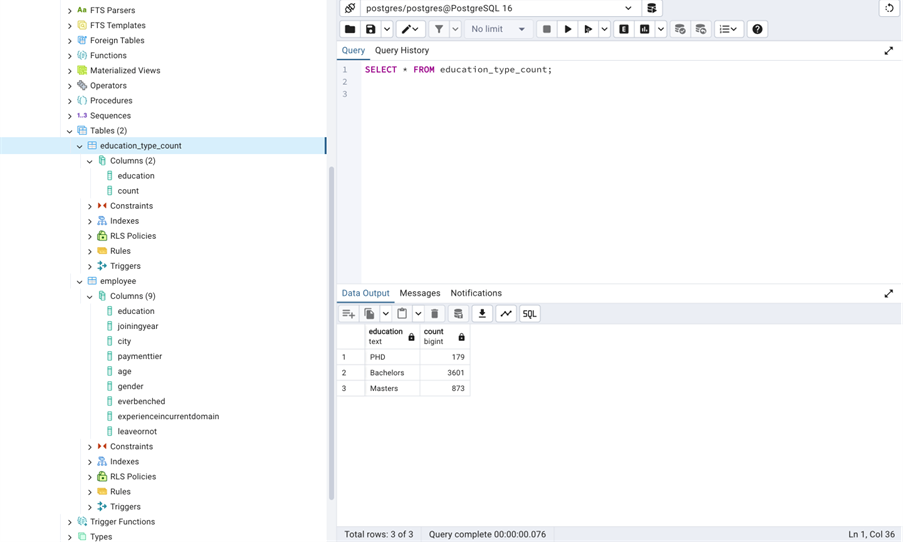
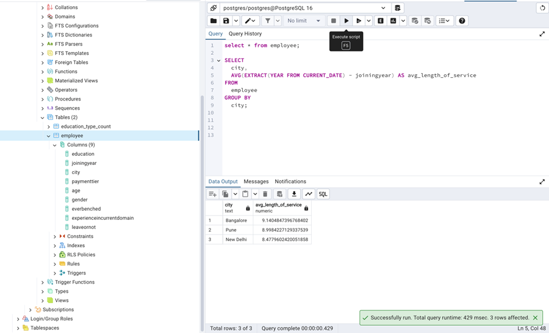
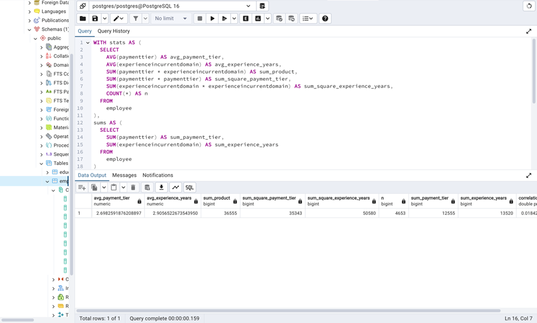
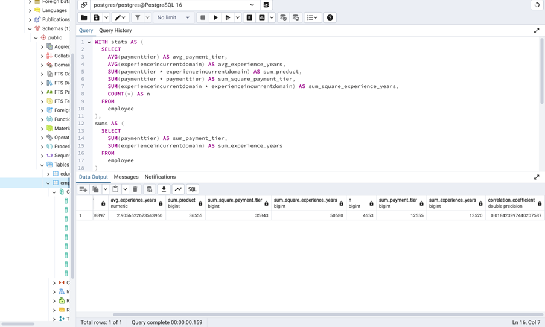
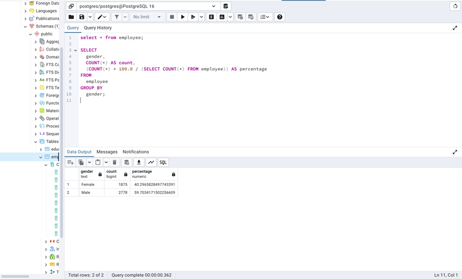

# Employee Dataset SQL

This dataset offers a comprehensive view of employees within a company, encompassing their educational backgrounds, work histories, demographic details, and employment-related factors. It has been anonymised to safeguard privacy while still offering valuable insights into the workforce.

This dataset is ideal for a range of HR and workforce analyses, such as examining employee retention, assessing salary structures, conducting diversity and inclusion studies, and analysing leave patterns. 

Columns:
1.   Education: The educational qualifications of employees, including degree, institution, and field of study.
2.  Joining Year: The year each employee joined the company, indicating their length of service.
3.	City: The location or city where each employee is based or works.
4.	Payment Tier: Categorization of employees into different salary tiers.
5.	Age: The age of each employee, providing demographic insights.
6.	Gender: Gender identity of employees, promoting diversity analysis.
7.	Ever Benched: Indicates if an employee has ever been temporarily without assigned work.
8.	Experience in Current Domain: The number of years of experience employees have in their current field.
9.	Leave or Not: a target column

While also providing the following as potential research questions:

1.	What is the distribution of educational qualifications among employees?
2.	How does the length of service (Joining Year) vary across different cities?
3.	Is there a correlation between Payment Tier and Experience in Current Domain?
4.	What is the gender distribution within the workforce?
5.	Are there any patterns in leave-taking behaviour among employees?

### Steps I Followed

#### Step 1: Creating the Table
First, I created a table in PGAdmin 4 that mirrors the headings in the CSV file I intended to import into the server. Here's a snippet showing how I set up the table:



#### Step 2: Importing the CSV File
Next, I imported the CSV file using a specific query. 

    COPY public.employee (education, joiningyear, city, paymenttier, age, gender,   everbenched, experienceincurrentdomain, leaveornot)
    FROM '/private/tmp/Employee.csv'
    DELIMITER ','
    CSV HEADER;


Then to ensure that everything copied over correctly, I ran a simple verification query. Which can be seen in the image below.



The first question I addressed was: *What is the distribution of educational qualifications among employees?*

To determine this, I first identified the different education types with the following query:

```sql
SELECT DISTINCT education FROM employee;
```



Then, I created another table to count each type of education and used the following query:

```sql
CREATE TABLE education_type_count AS
SELECT education_type, COUNT(*) as count
FROM employee
GROUP BY education_type;
```
Then again ran another query as followed:

```sql
SELECT * FROM education_type_count;
```



From the results, I observed that there were 4,563 rows. I calculated the percentage distribution of each education type as follows:
- **PhD:** 179 (3%)
- **Bachelors:** 3,601 (79%)
- **Masters:** 873 (19%)

Here's how you calculate these percentages in SQL:

```sql
CREATE TABLE education_type_percentage AS
SELECT
  education_type,
  COUNT(*) AS count,
  (COUNT(*) * 100.0 / (SELECT COUNT(*) FROM employee)) AS percentage
FROM employee
GROUP BY education_type;
```

#### Step 3: Analysing Length of Service Across Cities
The second question was: *How does the length of service (joining year) vary across different cities?*

To answer this question, I used the following query:
```sql
SELECT * FROM employee;
```

And then:
```sql
SELECT
  city,
  AVG(EXTRACT(YEAR FROM CURRENT_DATE) - joiningyear) AS avg_length_of_service
FROM
  employee
GROUP BY
  city;
```
Based on the SQL query output and as shown below, I found the average length of service to be:
- Bangalore: 9 years
- Pune: 8.9 years
- New Delhi: 8.4 years



#### Step 4: Correlation Between Payment Tier and Experience
The third question was: *Is there a correlation between payment tier and experience in the current domain?*
While SQL doesn’t have a built-in function to directly calculate the correlation coefficient, it can be done using mathematical formulas which is detailed below:

```sql
SELECT * FROM employee;

WITH stats AS (
  SELECT
    AVG(paymenttier) AS avg_payment_tier,
    AVG(experienceincurrentdomain) AS avg_experience_years,
    SUM(paymenttier * experienceincurrentdomain) AS sum_product,
    SUM(paymenttier * paymenttier) AS sum_square_payment_tier,
    SUM(experienceincurrentdomain * experienceincurrentdomain) AS sum_square_experience_years,
    COUNT(*) AS n
  FROM
    employee
),
sums AS (
  SELECT
    SUM(paymenttier) AS sum_payment_tier,
    SUM(experienceincurrentdomain) AS sum_experience_years
  FROM
    employee
)
SELECT
  (sum_product - (sum_payment_tier * sum_experience_years / n)) /
  SQRT(
    (sum_square_payment_tier - (sum_payment_tier * sum_payment_tier / n)) *
    (sum_square_experience_years - (sum_experience_years * sum_experience_years / n))
  ) AS correlation_coefficient
FROM
  stats, sums;
  ```

To provide a comprehensive answer, I structured a query that outputs intermediate values as well as the final result:

```sql
WITH stats AS (
  SELECT
    AVG(paymenttier) AS avg_payment_tier,
    AVG(experienceincurrentdomain) AS avg_experience_years,
    SUM(paymenttier * experienceincurrentdomain) AS sum_product,
    SUM(paymenttier * paymenttier) AS sum_square_payment_tier,
    SUM(experienceincurrentdomain * experienceincurrentdomain) AS sum_square_experience_years,
    COUNT(*) AS n
  FROM
    employee
),
sums AS (
  SELECT
    SUM(paymenttier) AS sum_payment_tier,
    SUM(experienceincurrentdomain) AS sum_experience_years
  FROM
    employee
)
SELECT
  stats.avg_payment_tier,
  stats.avg_experience_years,
  stats.sum_product,
  stats.sum_square_payment_tier,
  stats.sum_square_experience_years,
  stats.n,
  sums.sum_payment_tier,
  sums.sum_experience_years,
  (stats.sum_product - (sums.sum_payment_tier * sums.sum_experience_years / stats.n)) /
  SQRT(
    (stats.sum_square_payment_tier - (sums.sum_payment_tier * sums.sum_payment_tier / stats.n)) *
    (stats.sum_square_experience_years - (sums.sum_experience_years * sums.sum_experience_years / stats.n))
  ) AS correlation_coefficient
FROM
  stats, sums;
 ```

 The two images below, show the output of the above query.




 #### Step 5: Gender Distribution in the Workforce
The fourth question was: *What is the gender distribution within the workforce?*

I found that women constitute 40% (1,875 employees) and men 60% (2,778 employees). 



This was calculated using the following query:
```sql
SELECT
  gender,
  COUNT(*) AS count,
  (COUNT(*) * 100.0 / (SELECT COUNT(*) FROM employee)) AS percentage
FROM
  employee
GROUP BY
  gender;
 ```

 #### Step 6: Patterns in Leave-Taking Behaviour
The final question was: *Are there any patterns in leave-taking behaviour among employees?*
Upon reviewing the original dataset from Kaggle, I concluded that this question is difficult to answer due to the lack of clarity regarding the 'leaveornot' values (0 and 1). Additionally, there isn’t a unique ID number to help answer the question accurately. Discussions on Kaggle have not provided clarity either. To properly address this question, the dataset would need a unique code for each employee, separate from their employment ID, to maintain anonymity.

If I were to calculate it, I would use a query similar to the following:
```sql
SELECT
  employee_id,
  COUNT(*) AS leave_count
FROM
  leave_records
GROUP BY
  employee_id;
 ```

 These steps outline my approach to exploring and analysing the dataset to answer various HR-related questions.
